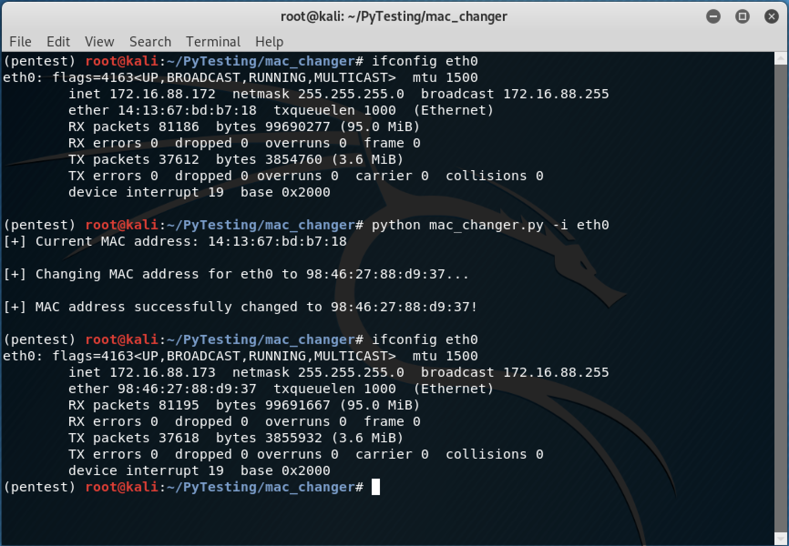

[](https://www.python.org/downloads/release/python-365/) [](http://perso.crans.org/besson/LICENSE.html) [](https://github.com/dwyl/esta/issues)

# MAC Address Changer - [Python]

A simple script to change the MAC address of a given interface. If a new MAC is not provided as argument, then a random one will be generated.

<p align="center">
  
</p>

## Description

TODO

## USAGE
TODO
```
# python mac_changer.py -i [interface] -m [new mac address]
```
